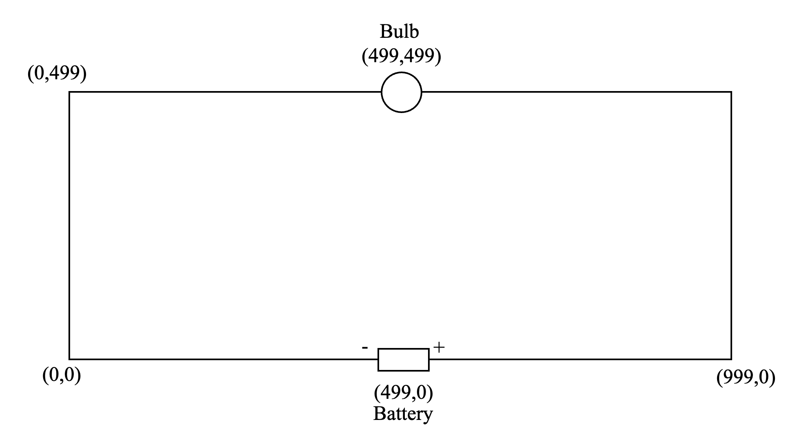
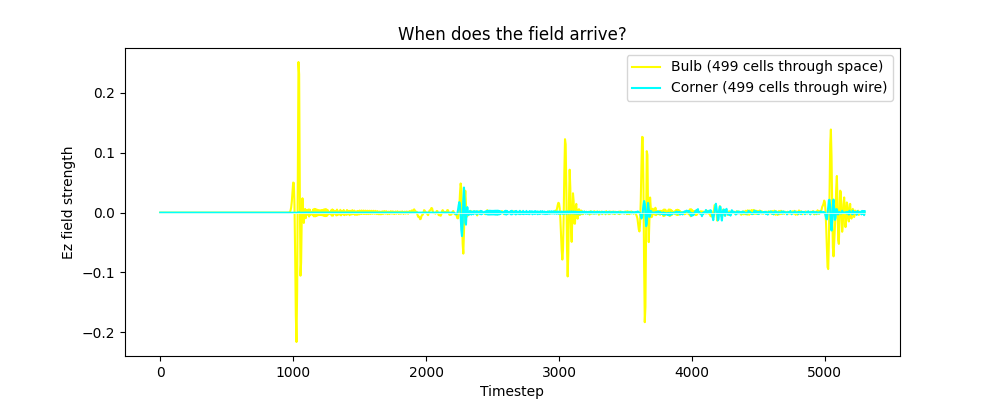

# fdtd-em-sim

A 2D electromagnetic field simulator using the FDTD (Finite Difference Time Domain) method, built to numerically verify the answer to the Veritasium circuit paradox.

## The Problem

Veritasium posed this question: if you have a circuit with wires 1 light second long, and close the switch, how long does it take for the bulb to turn on?

The intuitive answer is 1 second, the time for electricity to travel through the wire. The correct answer is 0.5 seconds. The reason is that energy is not carried by electrons through the wire. It is carried by the electromagnetic field propagating through the space between the wires. The bulb turns on when the field reaches it through space, not when the current completes the circuit through the wire.

This simulation proves that numerically.

## Circuit Geometry

- Rectangle: 1 light second wide, 0.5 light seconds tall
- Battery at midpoint of bottom wire
- Bulb at midpoint of top wire, directly above the battery
- Distance through space: 0.5 light seconds
- Distance through wire: 1.5 light seconds minimum

## Physics

Maxwell's curl equations in 2D:
*`∂Ez/∂t = (∂Hy/∂x - ∂Hx/∂y) / ε`
*`∂Hx/∂t = -∂Ez/∂y / μ`
*`∂Hy/∂t = ∂Ez/∂x / μ`

These are discretized on a 2D grid using the FDTD leapfrog scheme H updates from E, then E updates from H, alternating every timestep. This is the standard method used in real RF and photonics research.

The wires are modeled as perfect electric conductors Ez is forced to zero along all four sides of the rectangle every timestep. The battery is modeled as a Gaussian pulse source injected into Ez at the source location.

## Unit System

- Grid: 1000 × 500 cells
- 1 cell = 3×10⁵ m (derived from 1.5×10⁸ m / 498 cells)
- Speed of light: c = 997 cells/second
- Stability condition: dt ≤ dx / (c × √2)
- Wave crosses 498 cells in ~999 timesteps = 0.5 seconds ✓

## What the simulation shows

Two signals are tracked:

- **Bulb** - measured just inside the top wire, directly above the battery. The field reaches here through open space in ~1000 timesteps, corresponding to 0.5 seconds in real units.
- **Corner** - measured near the bottom left corner. The field must travel through the wire to reach here, taking significantly longer.

The bulb signal spikes first proving the field arrives through space before it arrives through the wire.

Two windows appear the field animation showing the EM wave propagating through the rectangular circuit, and the signal plot showing when the field arrives at the bulb vs the wire path.

## Results

The signal plot shows two traces over time:

- The bulb receives the field at timestep ~1000, corresponding to 0.5 seconds in real units. This matches the Veritasium answer exactly.
- The wire path signal arrives significantly later, consistent with the longer path the field must travel through the conductor.

The ratio of arrival times matches the ratio of distances the field through space travels 498 cells, the field through the wire travels a minimum of 998 cells (down the bottom wire to the corner and back up). The bulb signal arrives roughly twice as early, confirming the field propagates at c through open space regardless of wire length.

The simulation also visually shows the circular wavefront expanding from the battery location, reaching the top wire (bulb location) well before it reaches the corners or travels the full wire path. This is the Poynting vector in action energy flowing through the field in space, not through the electrons in the wire.

The Veritasium answer of 0.5 seconds is not a trick or a technicality. It is a direct consequence of Maxwell's equations, and this simulation reproduces it from first principles using only numpy.

## Possible extensions

- PML (Perfectly Matched Layer) absorbing boundaries to eliminate reflections
- Dielectric materials inside the grid
- Multiple frequency sources
- 3D FDTD simulation
- Measure Poynting vector to visualize energy flow direction